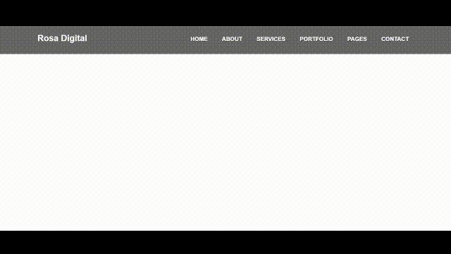
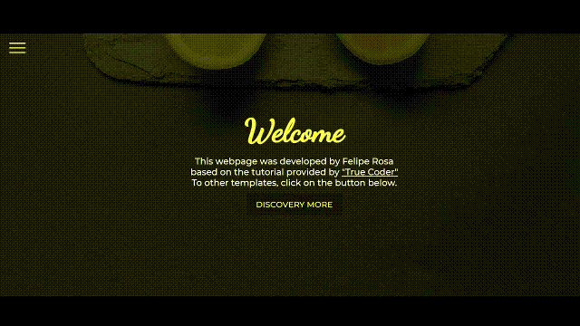
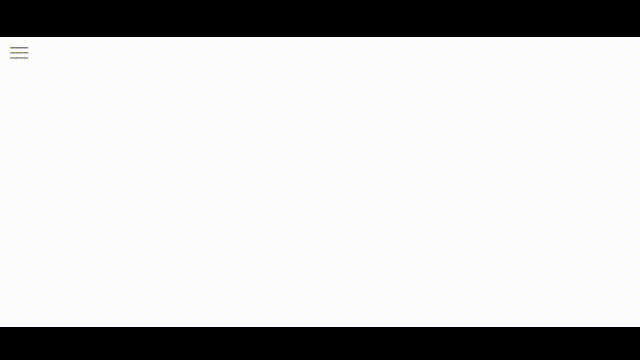

# Navigation for Html
## 💻 About this project (sobre este projeto)
:us: This project aimed testing and learning HTML, CSS, and JS codes with focus on different types of navbars, some of them based on youtube tutorials.

:brazil: Este projeto teve por objetivo testar e conhecer códigos em HTML, CSS, e JS com foco em diferentes tipos de navbars, alguns deles baseado em tutoriais do youtube.

---
## ⚙️ Project demonstration (demontração do projeto)

- Model 01: Navbar with dropdown menu
<p align="center"> 

- Model 02 - version 01: Navbar with different position
<p align="center"> 

- Model 02 - version 02: Navbar with different position
<p align="center"> 

- Model 02 - version 03: Navbar with different position
<p align="center"> 

- Model 02 - version 04: Navbar with button to hidde with background
<p align="center"> 
	
- Model 02 - version 05: Navbar with button to hidde without background
<p align="center"> 

- Model 03: Transparent navbar
<p align="center"> 


---
	
## 💡 Knowledge acquired (conhecimentos adquiridos)

- During this project, I learned:
  - how to animating a navbar;
  - how to create different types of navbars.


---

## 🚀 How to execute this project (como executar este projeto)

To execute this project you will only need a browser and the program Visual Studio Code.

### Requirements (requisitos)

Before you begin, you will need to install on your computer the following tool: [VSCode](https://code.visualstudio.com/)

#### 🎲 Running the codes (rodando os códigos)

```bash

# Clone this repository
$ git@github.com:rosadigital/Navigation-for-Html.git

# Open the repository on VS Code to run

```

---

## 🦸 Author (autor)


Felipe Rosa on [LinkedIn](https://www.linkedin.com/in/felipe-rosa/)

---

## 📝 License (licença)

This project is licensed under [MIT](./LICENSE).

Este projeto esta sobe a licença [MIT](./LICENSE).

Made with ❤️ by Felipe Rosa 👋🏽 [Contact here!](https://www.linkedin.com/in/felipe-rosa/)

Feito com ❤️ por Felipe Rosa 👋🏽 [Entre em contato!](https://www.linkedin.com/in/felipe-rosa/)

--
